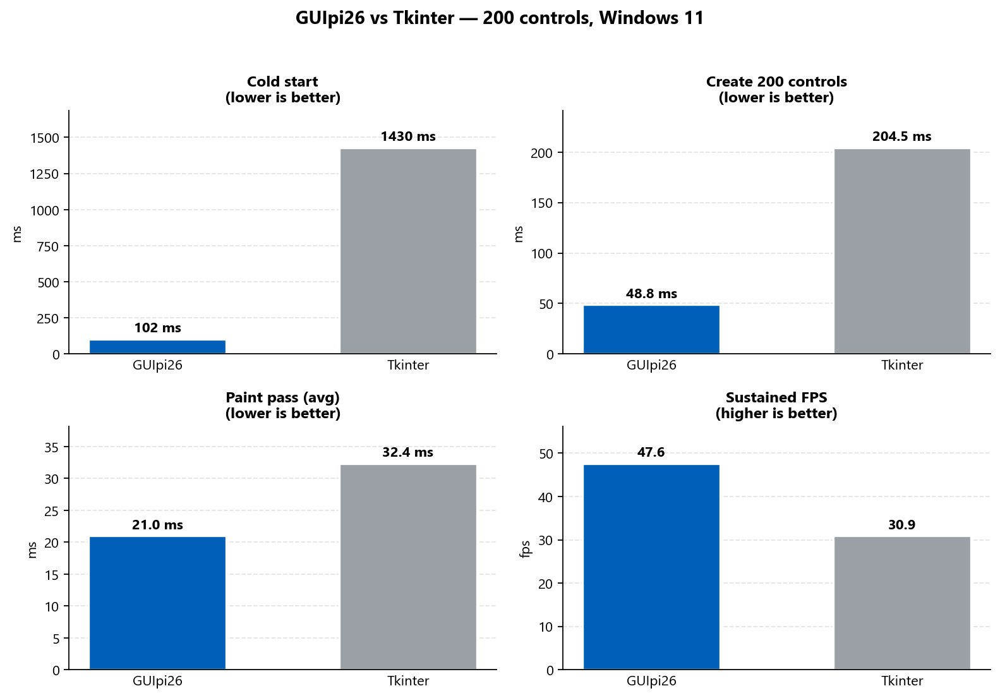
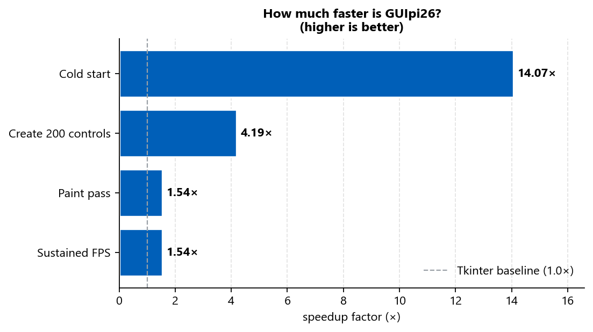

<div align="center">


### A fast, custom-rendered Windows UI engine for Python

No Tkinter. No Qt. Just `ctypes` over Win32 + GDI — with modern controls, a Bootstrap-style sidebar shell, and **14× faster cold starts** than Tkinter.

[](https://github.com/DillanStep/guipi26/actions/workflows/ci.yml)
[](https://github.com/DillanStep/guipi26/actions/workflows/security.yml)
[](https://github.com/DillanStep/guipi26/actions/workflows/guardian.yml)
[](https://github.com/DillanStep/guipi26/security/code-scanning)
[](https://scorecard.dev/viewer/?uri=github.com/DillanStep/guipi26)

[](https://pypi.org/project/guipi26/)
[](https://pypi.org/project/guipi26/)
[](LICENSE)
[](https://github.com/PyCQA/bandit)
[](https://github.com/pypa/pip-audit)

[**Install**](#install) · [**Quickstart**](#quickstart) · [**Examples**](#examples) · [**Benchmarks**](#benchmarks) · [**Docs**](docs/README.md)

</div>

---

> **Early preview (alpha).** APIs may change between releases. Pin a specific version if you build on it. Windows only · Python 3.8+

## Why GUIpi26

| | |
|---|---|
| ⚡ **Fast** | Custom GDI renderer with double-buffered painting. 14× faster cold start, 4× faster control creation than Tkinter. |
| 🪶 **Zero dependencies** | Pure standard library + `ctypes`. No Tcl/Tk, no Qt binaries, no wheels to compile. |
| 🎨 **Modern by default** | Bootstrap-inspired sidebar shell, themable palette, cards/panels, charts and grids out of the box. |
| 🧱 **Real widgets** | Text inputs, dropdowns, sliders, switches, list boxes, tree views, menubars, tooltips, message boxes. |
| 📜 **Scrollable windows** | Opt-in window-level scrollbar with overflow detection — pin status bars, scroll the rest. |
| 🛡️ **Hardened CI** | Performance gate, UI safety linter, CodeQL, bandit, pip-audit, gitleaks, OpenSSF Scorecard. |

## Install

```bash
pip install --pre guipi26
```

> `--pre` is required while GUIpi26 is in alpha. Plain `pip install guipi26` will skip pre-releases.

## Quickstart

```python
from guipi26 import (
    create_window, set_theme, create_collapsible_nav_bar,
    create_label, create_card, create_nav_bar,
)

app = create_window("My App", 1200, 760)
set_theme(app, background="#f5f6f8", surface="#ffffff", accent="#0d6efd")

create_collapsible_nav_bar(
    app, "MyApp",
    [
        {"key": "home",  "title": "Home",  "subtitle": "Start here"},
        {"key": "stats", "title": "Stats", "subtitle": "Numbers"},
    ],
    width=240, collapsed_width=72, selected_key="home",
)

cx = app.content_origin_x(padding=32)
create_label(app, "Home", x=cx, y=32, width=420, height=40, style="title", tab="home")
create_nav_bar(app, "Today", x=cx, y=130, width=800, subtitle="A quick look.", tab="home")
create_card(app, "Sessions", "24", x=cx, y=200, width=240, height=110,
            subtitle="up 12%", accent="#0d6efd", tab="home")
create_label(app, "Stats", x=cx, y=32, width=420, height=40, style="title", tab="stats")

app.mainloop()
```

Tag any control with `tab="key"` to scope it to a sidebar entry. The shell only paints controls whose tag matches the active sidebar key (or untagged controls).

## What's in the box

**Shell & layout** — `create_window`, `create_collapsible_nav_bar`, `create_nav_bar`, `create_panel`, `create_horizontal_grid`, `create_vertical_grid`, `set_theme`

**Controls** — `create_label`, `create_button`, `create_card`, `create_text_input`, `create_text_area`, `create_checkbox`, `create_switch`, `create_radio_group`, `create_slider`, `create_dropdown`, `create_progress_bar`, `create_list_box`, `create_tree_view`

**Data viz** — `create_chart`, `create_grid`

**Window features** — menubar, tooltips, message boxes, accelerators, vertical scrollbar (`enable_scrolling`), `set_min_size`

## Examples

| Example | What it shows |
|---|---|
| [`examples/dashboard.py`](examples/dashboard.py) | KPI cards, charts, sidebar |
| [`examples/forms/app.py`](examples/forms/app.py) | Full form-control suite with validation |
| [`examples/widgets/app.py`](examples/widgets/app.py) | Responsive 3-column widget showcase |
| [`examples/enterprise/app.py`](examples/enterprise/app.py) | **Northwind Analytics** — multi-page CRM-style demo |

```bash
python examples/dashboard.py
python examples/enterprise/app.py
```

## Benchmarks

GUIpi26 vs Tkinter — Windows 11, Python 3.9, 200 controls, median of 2 runs.

<div align="center">



</div>

| Metric | GUIpi26 | Tkinter | Winner |
|---|---:|---:|---|
| Cold start | **101 ms** | 1430 ms | 🏆 GUIpi26 — **14.0×** |
| Create 200 controls | **49 ms** | 205 ms | 🏆 GUIpi26 — **4.2×** |
| Paint average | **21 ms** | 32 ms | 🏆 GUIpi26 — **1.5×** |
| Sustainable FPS | **47.6** | 30.9 | 🏆 GUIpi26 — **1.5×** |

<div align="center">



</div>

Reproduce with `python benchmarks/run_all.py`, then regenerate the charts with `python benchmarks/plot_results.py`. See [`benchmarks/README.md`](benchmarks/README.md) for methodology.

## Documentation

Full docs live in [`docs/`](docs/README.md):

- [Getting started](docs/getting-started.md)
- [Components](docs/components.md)
- [Layout & responsiveness](docs/layout.md)
- [Theming](docs/theming.md)
- [Card collision safety](docs/collision-safety.md)
- [API reference](docs/api-reference.md)
- [Publishing](docs/publishing.md)

## Quality gates

Every push and PR runs:

| Gate | What it checks |
|---|---|
| **CI** | Build + smoke-test on Windows for Python 3.9–3.12 |
| **Guardian** | UI safety AST linter (8 rules) + perf-regression gate |
| **Security** | pip-audit (CVEs), bandit (static analysis), gitleaks (secrets), CodeQL, dependency-review |
| **OpenSSF Scorecard** | Supply-chain security score |

## Contributing

PRs welcome. See [CONTRIBUTING.md](CONTRIBUTING.md) and the issue templates in [`.github/ISSUE_TEMPLATE/`](.github/ISSUE_TEMPLATE/).

## License

MIT — see [LICENSE](LICENSE).

<div align="center">
<sub>Built with Win32, GDI, and a stubborn refusal to ship Qt binaries.</sub>
</div>
# GUIpi26

[](https://github.com/DillanStep/guipi26/actions/workflows/ci.yml)
[](https://github.com/DillanStep/guipi26/actions/workflows/security.yml)
[](https://github.com/DillanStep/guipi26/actions/workflows/guardian.yml)
[](https://github.com/DillanStep/guipi26/security/code-scanning)
[](https://scorecard.dev/viewer/?uri=github.com/DillanStep/guipi26)
[](https://pypi.org/project/guipi26/)
[](https://pypi.org/project/guipi26/)
[](LICENSE)
[](https://github.com/PyCQA/bandit)
[](https://github.com/pypa/pip-audit)

> **Early preview (alpha).** This is a proof of concept — expect breaking API changes between releases. Pin a specific version if you build on it.

A fast, custom-rendered Windows UI engine for Python. No Tkinter, no Qt — just `ctypes` over Win32 and GDI, with a small set of modern controls and a Bootstrap-style sidebar shell.

> Windows only. Python 3.8+.

## Install

```
pip install --pre guipi26
```

(`--pre` is required while GUIpi26 is in alpha. Plain `pip install guipi26` will skip pre-releases.)

## Hello, sidebar

```python
from guipi26 import (
    create_window, set_theme, create_collapsible_nav_bar,
    create_label, create_card, create_nav_bar,
)

app = create_window("My App", 1200, 760)
set_theme(app, background="#f5f6f8", surface="#ffffff", accent="#0d6efd")

create_collapsible_nav_bar(
    app, "MyApp",
    [
        {"key": "home", "title": "Home", "subtitle": "Start here"},
        {"key": "stats", "title": "Stats", "subtitle": "Numbers"},
    ],
    width=240, collapsed_width=72, selected_key="home",
)

cx = app.content_origin_x(padding=32)

create_label(app, "Home", x=cx, y=32, width=420, height=40, style="title", tab="home")
create_nav_bar(app, "Today", x=cx, y=130, width=800, subtitle="A quick look.", tab="home")
create_card(app, "Sessions", "24", x=cx, y=200, width=240, height=110, subtitle="up 12%", accent="#0d6efd", tab="home")

create_label(app, "Stats", x=cx, y=32, width=420, height=40, style="title", tab="stats")

app.mainloop()
```

## What's in the box

- `create_window` — the host window
- `create_collapsible_nav_bar` — full-height left sidebar with collapse toggle
- `create_nav_bar` — page header with title, subtitle, and action buttons
- `create_label`, `create_button`
- `create_card`, `create_panel`
- `create_grid` — simple data grid
- `create_chart` — bar chart
- `create_horizontal_grid`, `create_vertical_grid` — layout helpers
- `set_theme` — background, surface, accent, etc.

Tag any control with `tab="key"` to scope it to a sidebar entry. The shell only paints controls whose tag matches the active sidebar key (or controls with no tag).

## Example

A full dashboard example lives in [`examples/dashboard.py`](examples/dashboard.py):

```
python examples/dashboard.py
```

## License

MIT — see [LICENSE](LICENSE).

## Documentation

Full docs live in [`docs/`](docs/README.md):

- [Getting started](docs/getting-started.md)
- [Components](docs/components.md)
- [Layout & responsiveness](docs/layout.md)
- [Theming](docs/theming.md)
- [Card collision safety](docs/collision-safety.md)
- [API reference](docs/api-reference.md)
- [Publishing](docs/publishing.md)

## Benchmarks

GUIpi26 vs Tkinter (Windows 11, Python 3.9, 200 controls, median of 2 runs):


| metric | GUIpi26 | Tkinter | winner |
| --- | --- | --- | --- |
| cold start | 101 ms | 1430 ms | **14.0x** GUIpi26 |
| create 200 controls | 49 ms | 205 ms | **4.2x** GUIpi26 |
| paint avg | 21 ms | 32 ms | **1.5x** GUIpi26 |
| sustainable FPS | 47.6 | 30.9 | **1.5x** GUIpi26 |

Reproduce with `python benchmarks/run_all.py`, then regenerate the charts with `python benchmarks/plot_results.py`. See [benchmarks/README.md](benchmarks/README.md) for methodology.
